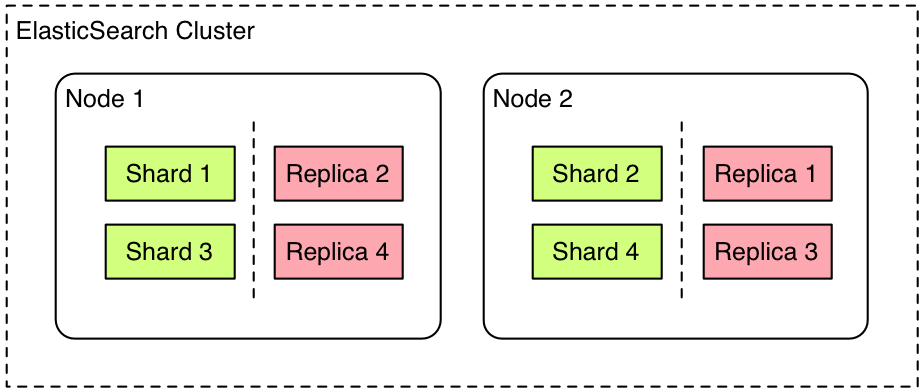

%Projecte final de grau
%Kevin Ramos Lopez
%ASX-Curs2 2015/2016

# Introducció

## Centralització de logs JSON en BBDD i post-processat

Serveis utilitzats:

> - Logstash
> - Elasticsearch
> - Kibana

## ELK


## Descripció

La gestió de dades a mesura que creixen es fa mes dura i pesada, es per
aixo que l'entorn ELK s'ha fet tant popular, ja que proporciona
un metode comode i ràpid per procesar grans cantitats d'informació.

## Open Source


## Plataformes que utilitzen ELK

> - Netflix
> - Stack Overflow
> - Linkedin
> - Fujitsu (Open Stack Cloud) 

I moltes mes...

# Logstash

## 


## Descripció

Logstash es un motor de recopilació de dades el cual permet unificar 
diferents entrades de dades i normalitzar aquestes en el destí indicat.

## Funcionament

El funcionament de logstash es basa en un fitxer de configuració.

`/etc/logstash/conf.d/name.conf`

`logstash -f /etc/logstash/conf.d/file-name.conf`

## Estructura fitxer de configuració

> - Input: S'indica quina serà l'entrada de dades a procesar.

> - Filter: Defineix els filtres que s'aplicaràn a les dades d'entrada.

> - Output: Indicarà la sortida d'aquetes dades, podrà ser des d'un 
servidor elasticsearch fins a un simple fitxer local.

## Exemple

```
input {
    file {
        path => "/var/log/apache-logs.log"
        start_position => "beginning"
        type => "apache"
    }
    file {
        path => "/var/log/mariadb.log"
        start_position => "beginning"
        type => "mysql"
    }
    file {
        path => "/var/log/messages"
        start_position => "beginning"
        type => "massive"
    }
}

filter {
    if [type] == "apache" {
		grok {
			match => { "message" => "%{COMBINEDAPACHELOG}"}
		}
		geoip {
			source => "clientip"
		}
	}
}

output {
    if [type] == "apache" {
        elasticsearch {
	        hosts => ["hostElast:9200"]
	        index => "logstash-%{+YYYY.MM.dd}"
        }
    }
    if [type] == "massive" {
        elasticsearch {
	        hosts => ["hostElast:9200"]
	        index => "%{type}-%{+YYYY.MM.dd}"
        }
    }
    if [type] == "mysql" {
        elasticsearch {
	        hosts => ["hostElast:9200"]
	        index => "%{type}-%{+YYYY.MM.dd}"
        }
    }
}

```

# Elasticsearch

##



## Descripció

Es un motor de busqueda basat en apache. Ens permet enmagatzemar,
i analitzar grans cantitats de dades a temps casi real.
Elasticsearch funciona en un clúster, en el cual es repliquen les dades
entre els diferents nodes.

Utilitza el port 9200.

## Conceptes bàsics

Clúster

Node

Index

Document

Shards i repliques

## Posibles estats del clúster

> - Red: Existeixen shards no assignats en el clúster. 

> - Yellow: Tots els shards estàn assignats, pero no hi han replicas 
d'alguns d'aquets.

> - Green: Tots els shards estàn assignats i amb les seves respectives 
repliques.

## Interacció amb elastic

Per interactuar amb elasticsearch es pot utilitzar cualsevol eina que 
ens permeti fer crides HTTP/REST. Com per exemple curl:

`curl 'localhost:9200/_cat/health?v'`

`curl 'localhost:9200/_cat/nodes?v`

`curl 'localhost:9200/_cat/indices?v`

## Interficie gràfica

Una manera mes comode de treballar amb elasticsearch es instalant algún
plugin que proporcioni una interficie gràfica, com per exemple el "head":

`elasticsearch/bin/plugin install mobz/elasticsearch-head`

Accedirem a traves de la url: `http://localhost:9200/_plugin/head/`

# Kibana

##


## Descripció

Es una plataforma d'ànalisis i visualització de dades. S'utilitza per interactuar amb les dades 
enmagatzemades d'elasticsearch.

Pot realitzar facilment anàlisis avançats de dades i visualitzar aquestes
a traves de gràfics i mapes. 

El port associat al servei es el 5601

## Fitxer de configuració

```

# Kibana is served by a back end server. This controls which port to use.
# server.port: 5601

# The host to bind the server to.
# server.host: "0.0.0.0"

# If you are running kibana behind a proxy, and want to mount it at a path,
# specify that path here. The basePath can't end in a slash.
# server.basePath: ""

# The maximum payload size in bytes on incoming server requests.
# server.maxPayloadBytes: 1048576

# The Elasticsearch instance to use for all your queries.
elasticsearch.url: "http://hostElast:9200"

# preserve_elasticsearch_host true will send the hostname specified in `elasticsearch`. If you set it to false,
# then the host you use to connect to *this* Kibana instance will be sent.
# elasticsearch.preserveHost: true

# Kibana uses an index in Elasticsearch to store saved searches, visualizations
# and dashboards. It will create a new index if it doesn't already exist.
# kibana.index: ".kibana"

# The default application to load.
# kibana.defaultAppId: "discover"

# If your Elasticsearch is protected with basic auth, these are the user credentials
# used by the Kibana server to perform maintenance on the kibana_index at startup. Your Kibana
# users will still need to authenticate with Elasticsearch (which is proxied through
# the Kibana server)
# elasticsearch.username: "user"
# elasticsearch.password: "pass"

# SSL for outgoing requests from the Kibana Server to the browser (PEM formatted)
# server.ssl.cert: /path/to/your/server.crt
# server.ssl.key: /path/to/your/server.key

# Optional setting to validate that your Elasticsearch backend uses the same key files (PEM formatted)
# elasticsearch.ssl.cert: /path/to/your/client.crt
# elasticsearch.ssl.key: /path/to/your/client.key

# If you need to provide a CA certificate for your Elasticsearch instance, put
# the path of the pem file here.
# elasticsearch.ssl.ca: /path/to/your/CA.pem

# Set to false to have a complete disregard for the validity of the SSL
# certificate.
# elasticsearch.ssl.verify: true

# Time in milliseconds to wait for elasticsearch to respond to pings, defaults to
# request_timeout setting
# elasticsearch.pingTimeout: 1500

# Time in milliseconds to wait for responses from the back end or elasticsearch.
# This must be > 0
# elasticsearch.requestTimeout: 30000

# Time in milliseconds for Elasticsearch to wait for responses from shards.
# Set to 0 to disable.
# elasticsearch.shardTimeout: 0

# Time in milliseconds to wait for Elasticsearch at Kibana startup before retrying
# elasticsearch.startupTimeout: 5000

# Set the path to where you would like the process id file to be created.
# pid.file: /var/run/kibana.pid

# If you would like to send the log output to a file you can set the path below.
# logging.dest: stdout

# Set this to true to suppress all logging output.
# logging.silent: false

# Set this to true to suppress all logging output except for error messages.
# logging.quiet: false

# Set this to true to log all events, including system usage information and all requests.
# logging.verbose: false

```

## Avantatges

- Permet administrar grans volums de dades de manera fàcil i ràpida. 

- Està disenyat per treballar amb elasticsearch

Es tant facil com instalar-ho i ja es podràn visualitzar les dades 
del servidor elasticsearch indicat.

#

<iframe src="http://192.168.2.43:5601/app/kibana#/dashboard/Logs-apache,-London-San-Francisco?embed=true&_g=(refreshInterval:(display:Off,pause:!f,value:0),time:(from:now-15m,mode:quick,to:now))&_a=(filters:!(),options:(darkTheme:!t),panels:!((col:7,id:city-name-logs-location-graffic,panelIndex:1,row:1,size_x:6,size_y:4,type:visualization),(col:1,id:geo-map-apache-logs,panelIndex:2,row:1,size_x:6,size_y:4,type:visualization),(col:1,columns:!(_index,agent,bytes,clientip,geoip.area_code,geoip.city_name,geoip.country_name,httpversion,message),id:'London-SanFrancisco-Gets-apache(9:48)',panelIndex:3,row:5,size_x:8,size_y:4,sort:!(_score,desc),type:search),(col:9,id:table-logs-city-count,panelIndex:4,row:5,size_x:4,size_y:4,type:visualization)),query:(query_string:(analyze_wildcard:!t,query:'*')),title:'Logs%20apache,%20London%20San%20Francisco',uiState:())" height="600" width="800"></iframe>

# FIN


